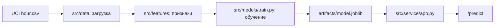

# Отчёт по итоговому проекту по курсу «Инженерия Искусственного Интеллекта»

> Рекомендуемый объём отчёта: 3-5 страниц в эквиваленте Markdown/печатного текста.  
> Отчёт должен позволить преподавателю понять задачу, данные, выбранные модели и результаты экспериментов.

---

## 1. Паспорт проекта

- **Название проекта:** `Прогноз спроса на велопрокат`
- **Автор:** `Некрасов Глеб Андреевич`
- **Группа:** `ИКБО-28-22`
- **Контакт:** `lfazz@mail.ru`
- **Ссылка на репозиторий:** `https://github.com/mirea-aie-2025/aie-student-template`

Проект посвящён построению ML-сервиса, который предсказывает количество аренд велосипедов за час по погодным и календарным признакам. Итоговый результат - FastAPI API с endpoint `/predict`, который загружает обученную модель `artifacts/model.joblib` и возвращает численный прогноз спроса.

---

## 2. Постановка задачи и контекст

Предметная область - городской велопрокат. Оператору сервиса важно заранее понимать, в какие часы спрос будет высоким, чтобы планировать обслуживание, наличие велосипедов и перераспределение ресурсов.

В терминах ML решается задача регрессии. На вход подаются признаки часа, месяца, сезона, типа дня, погодной ситуации, температуры, влажности и скорости ветра. Целевая переменная - `cnt`, количество аренд велосипедов за конкретный час.

Основные метрики:

- `MAE` - средняя абсолютная ошибка в количестве аренд, легко интерпретируется;
- `RMSE` - сильнее штрафует крупные промахи;
- `R2` - показывает долю объяснённой дисперсии.

---

## 3. Данные

Источник данных - открытый [UCI Bike Sharing Dataset](https://archive.ics.uci.edu/ml/datasets/bike%2Bsharing%2Bdataset). В проекте используется файл `hour.csv`, где каждая строка соответствует одному часу работы проката. Датасет не содержит персональных данных.

Ключевые признаки:

- календарные: `season`, `yr`, `mnth`, `hr`, `holiday`, `weekday`, `workingday`;
- погодные: `weathersit`, `temp`, `atemp`, `hum`, `windspeed`;
- целевая переменная: `cnt`.

Признаки `casual` и `registered` намеренно исключены. Они в сумме образуют `cnt`, поэтому их использование было бы утечкой целевой переменной.

EDA вынесен в `notebooks/01_eda.ipynb`. Основные наблюдения: спрос сильно зависит от часа дня, заметно растёт в пиковые часы, меняется по сезонам и снижается при ухудшении погодных условий. В `artifacts/hourly_demand.png` сохранён график среднего спроса по часам.

---

## 4. Модели и подходы

Были обучены три модели:

| Модель | Назначение | Комментарий |
|---|---|---|
| `dummy_mean` | baseline | Всегда предсказывает среднее значение спроса |
| `ridge` | линейная модель | Проверяет качество простого интерпретируемого подхода |
| `random_forest` | улучшенная модель | Улавливает нелинейные зависимости часа, погоды и календаря |

Для категориальных признаков используется `OneHotEncoder`, для числовых - `StandardScaler`. Все шаги объединены в `sklearn.pipeline.Pipeline`, поэтому сохранённый `model.joblib` содержит и предобработку, и модель.

---

## 5. Экспериментальный протокол и результаты

Данные разделены на train/validation/test в пропорции 70/15/15 с фиксированным `random_state=42`. Такой split выбран потому, что сервис оценивает спрос по условиям поездки, а не строит строгий временной прогноз будущего ряда. Проверка без утечки обеспечена исключением `casual`, `registered`, `instant` и `dteday` из обучающих признаков.

Результаты:

| Модель | Split | MAE | RMSE | R2 |
|---|---|---:|---:|---:|
| `dummy_mean` | validation | 138.7511 | 174.2015 | -0.0010 |
| `ridge` | validation | 74.0396 | 99.5083 | 0.6734 |
| `random_forest` | validation | 40.8114 | 61.6120 | 0.8748 |
| `random_forest` | test | 39.4357 | 59.5060 | 0.8882 |

Финальной выбрана модель `random_forest`, потому что она дала лучший RMSE и MAE на validation и подтвердила качество на test. Важные признаки сохранены в `artifacts/feature_importance.csv`; среди них наиболее заметны ощущаемая температура `atemp`, час поездки, год, влажность и рабочий день.

---

## 6. Архитектура решения и сервис



Реализованные endpoints:

- `GET /` - пользовательский интерфейс с формой прогноза;
- `GET /health` - показывает статус сервиса и наличие модели;
- `GET /model-info` - возвращает метаданные обучения;
- `POST /predict` - принимает один объект и возвращает прогноз;
- `POST /predict-batch` - принимает список объектов и возвращает пакет прогнозов.

Пользовательский интерфейс не заменяет API, а вызывает тот же endpoint `/predict`. В форме можно выбрать дату, час, тип дня, погоду, температуру, влажность и ветер. Дата автоматически преобразуется в месяц, день недели и сезон, чтобы пользователю не приходилось вручную кодировать признаки датасета.

Пример входа для `/predict`:

```json
{
  "season": 3,
  "mnth": 7,
  "hr": 17,
  "holiday": 0,
  "weekday": 3,
  "workingday": 1,
  "weathersit": 1,
  "yr": 1,
  "temp": 0.76,
  "atemp": 0.72,
  "hum": 0.45,
  "windspeed": 0.18
}
```

---

## 7. Наблюдаемость, конфигурация и безопасность

В сервисе есть консольное логирование HTTP-запросов: метод, путь, статус и длительность обработки. Endpoint `/health` позволяет быстро проверить, что сервис поднялся и видит модель.

Параметры проекта вынесены в `configs/config.yaml`: пути к данным, split, список признаков, гиперпараметры модели и настройки сервиса. Шаблоны переменных окружения лежат в `.env.example` и `configs/.env.example`.

В репозитории нет реальных секретов, токенов, паролей или персональных данных. Файл `.env` добавлен в `.gitignore`. Подробности описаны в `SECURITY.md`.

---

## 8. Ограничения и дальнейшая работа

Ограничения текущей версии:

- данные относятся к 2011-2012 годам и могут не отражать современный спрос;
- не учитываются специальные события, цены, состояние станций и реальные остатки велосипедов;
- сервис не хранит историю запросов и не отслеживает дрейф данных;
- модель не является строгой временной моделью.

Возможные улучшения:

- добавить свежие данные и регулярное переобучение;
- сравнить Random Forest с градиентным бустингом;
- добавить мониторинг качества и логирование распределения входных признаков;
- расширить API сценариями планирования спроса на день.

---

## 9. Сценарий демонстрации на защите

1. Показать структуру проекта: `src/`, `data/`, `notebooks/`, `artifacts/`, `tests/`.
2. Показать `notebooks/01_eda.ipynb` и `notebooks/02_model_experiments.ipynb`.
3. Открыть `artifacts/metrics.csv` и объяснить выбор `random_forest`.
4. Запустить сервис командой `python -m src.service`.
5. Открыть пользовательский интерфейс на `http://127.0.0.1:8000`.
6. Заполнить форму и показать прогноз количества аренд велосипедов за час.
7. Открыть Swagger UI на `http://127.0.0.1:8000/docs` как техническую проверку API.
8. Показать `/health` и `/model-info`.

---
